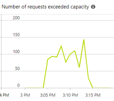
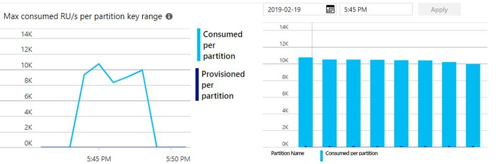

# Java sample that measures Request Unit for specific queries and runs load test on Azure Cosmos DB Cassandra API
This sample lets you run custom CQL queries and outputs the Azure Cosmos DB Request Units consumed by each query.  It can also run a stress test by importing a csv in multiple threads. 

## How to run simple queries and measure Request Unit
1. Set your Cosmos DB Cassandra connection information in [config.properties](src/main/resources/config.properties).
2. Configure [query.properties](src/main/resources/query.properties) for creating a keyspace, table, and the queries you want to run.
3. Run `mvn clean package` from the project root folder. This will generate an uber jar `cosmosdb-cassandra-test.jar` under `target` folder.
4. Run `java -jar target/cosmosdb-cassandra-test.jar` and observe console output.

## How to run stress test
The stress test is less configurable. 
1. It uses DataStax Cassandra driver annotation in [RecordToInsert.java](src/main/java/com/paigeliu/cosmoscassandra/RecordToInsert.java).  The keyspace name is `mytestks` and the table name is `mytesttbl`. You must create the keyspace and the table first. You can use the run simple query option described above to create them. The table must be of the following schema:
```sql
tid varint
tidx double 
tval float
```
2. Create or generate a csv file with 3 columns mapping to the above schema. The csv file must use comma "," as separator, and must not have header. Here's a [sample data file](data/sample.csv).
3. Configure the csv file path in [query.properties](src/main/resources/query.properties). 
4. You can also set the number of threads that will simultaneously insert data into Cosmos DB, and the max number of retries for each insert upon throttling in [config.properties](src/main/resources/config.properties).
5. Run `mvn clean package` from the project root folder. This will generate an uber jar `cosmosdb-cassandra-test.jar` under `target` folder.
6. Run `java -jar target/cosmosdb-cassandra-test.jar --load`. The app will print out the duration of the test at the end. Meanwhile, you can also observe throughput and error in Azure portal, for example:


## How to calculate the number of Request Units you need
1. Measure how much RU is required to write a single row: `S` RU. You can use this app without the `--load` option to measure a single operation. 
2. Count how many rows to ingest in total: `T` rows.
3. How long must ingestion finish: `F` seconds. 
4. Total RUs required = `T rows x S RU/row / F seconds`. 
5. For example, if each row takes 7 RU to write, with 2M rows total, if ingestion should finish in 10 minutes, then we need `2M rows x 7 RU/row / (10 minutes x 60 seconds/minute) = 24K RUs`. 
6. This is server side only, not counting client app overhead, network latency, exponential backoff on error and retries. It also assumes data is uniformly distributed by partition key, and client app is capable to drive the throughput.

## How to run Spark jobs against Cosmos DB
Instead of writing a multi-threaded application, you can also run workloads on Spark against Cosmos DB Cassandra API to drive up throughput by leveraging Spark's built-in distributed computing capabilities. There are a couple things you need to plan and configure in order to bring the best performance of Cosmos DB in Spark:
1. If you run in a Databricks notebook, `spark.cassandra.connection.factory` must be set to `com.microsoft.azure.cosmosdb.cassandra.CosmosDbConnectionFactory` at the cluster level, not inside the notebook.  This ensures the driver knows how to correctly handle errors and retry when the server is overloaded. Otherwise, you may find your job either run slowly or when you tune up the number of concurrent writes, it fails because the server is overloaded.
2. Given Cosmos DB SLA of 10ms latency per read and 15m per write at 99th percentile, each thread can do about 100 operations per second. Most of the time, the latency is half of the SLA max, so each thread can do about 200 operations per second. 
3. Spark has a total of `#nodes x #cores/node x spark.cassandra.output.concurrent.writes` threads. So total RU required should be `#nodes x #cores/node x spark.cassandra.output.concurrent.writes x 200 operations/second x #RU/operation`.
4. The following example writes 2M rows to Cosmos DB Cassandra in a Spark cluster with 2 4-core nodes. Number of concurrent writes is set to 4, and each write takes 7 RU. So a total of `2 nodes x 4 cores x 4 concurrent threads/core x 200 writes/thread x 7 RUs/write = 45K RUs` are required. `45K RUs / 7 RU/row = 6K rows/s`. 2M rows should take about `2M / 6K / 60 seconds/min = 6 minutes`. This is of course server side only, not counting client app overhead, network latency, exponential backoff on error and retries. It also assumes data is uniformly distributed by partition key. The actual Spark job finished end-to-end in 12 minutes as shown below, with a relatively small number of overloaded requests. 

 

## Run cassandra-stress tool
You can run [the cassandra-stress tool](https://docs.datastax.com/en/cassandra/3.0/cassandra/tools/toolsCStress.html) against Cosmos DB. While it may not represent real world workload perfectly, it's at least a great way to check your Cosmos DB is performing as expected for the synthetic workload you specify. 

This sample [cassandra-stress yaml file](cassandrastress.yml) simulate the same table structure and similar data distribution as in the above example. You can run cassandra-stress with the following command:
```sh
cassandra-stress user profile=cassandrastress.yaml no-warmup ops\(insert=1\) n=2000000 cl=QUORUM -rate threads=128 -node {cosmos_db_account}.cassandra.cosmosdb.azure.com -port native=10350 -transport ssl-protocol=TLSv1.2 factory=org.apache.cassandra.thrift.SSLTransportFactory truststore={/path/to/truststore} truststore-password={password} -mode native cql3 connectionsPerHost=128 user={cosmos_db_account} password={cosmos_db_key}

	Op rate                   :    8,380 op/s  [insert: 8,380 op/s]
	Partition rate            :    8,380 pk/s  [insert: 8,380 pk/s]
	Row rate                  :    8,380 row/s [insert: 8,380 row/s]
	Latency mean              :    7.6 ms [insert: 7.6 ms]
	Latency median            :    5.7 ms [insert: 5.7 ms]
	Latency 95th percentile   :    8.7 ms [insert: 8.7 ms]
	Latency 99th percentile   :   15.9 ms [insert: 15.9 ms]
	Latency 99.9th percentile :  518.5 ms [insert: 518.5 ms]
	Latency max               : 4399.8 ms [insert: 4,399.8 ms]
	Total partitions          :  2,185,908 [insert: 2,185,908]
	Total errors              :          0 [insert: 0]
	Total GC count            : 0
	Total GC memory           : 0.000 KiB
	Total GC time             :    0.0 seconds
	Avg GC time               :    NaN ms
	StdDev GC time            :    0.0 ms
	Total operation time      : 00:04:20
``` 
You can see the median latency is 5.7ms, and the 99th percentile is a little over 15ms. The cluster is overloaded during the run as shown below, so there are a lot of retries which count as op/s.  The data is evenly distributed among partitions. 


 
